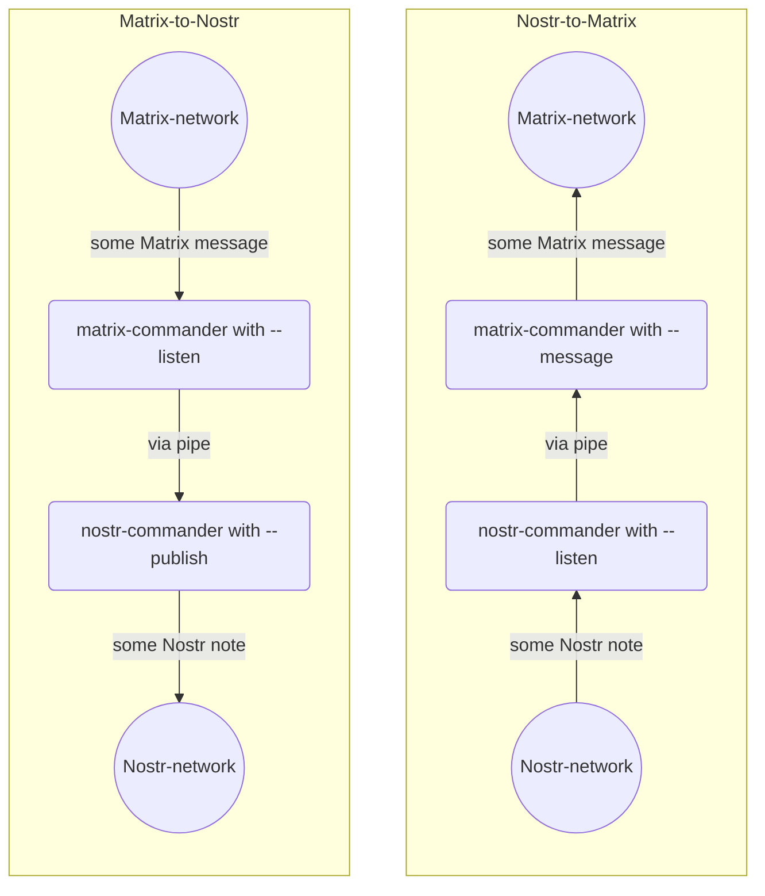
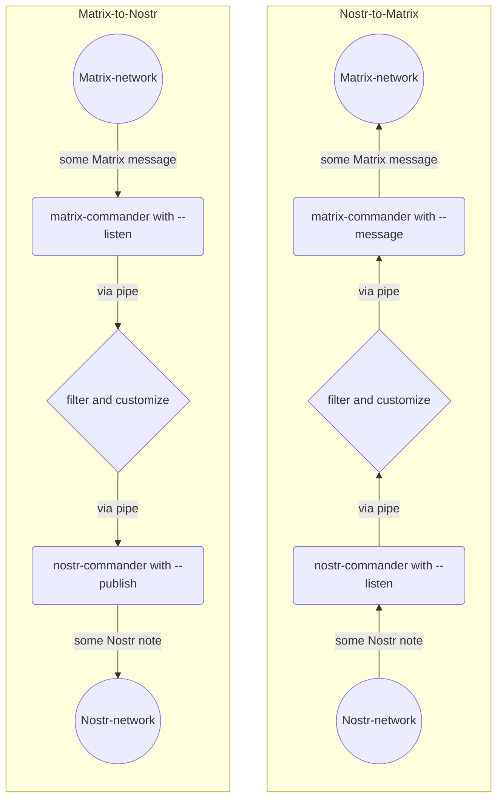

# matrix-nostr-bridge
Bridge between Matrix and Nostr communication protocols.

If you like the idea, give it a Github star :star: right away!

# Setup

- get familiar with [matrix-commander](https://github.com/8go/matrix-commander) (Python) or [matrix-commander](https://github.com/8go/matrix-commander-rs) (Rust)
- get familiar with [nostr-commander](https://github.com/8go/nostr-commander-rs) (Rust)
- configure and run 2 `matrix-commander`s, one for Matrix-to-Nostr, another one for Nostr-to-Matrix
- configure and run 2 `nostr-commander`s, one for Matrix-to-Nostr, another one for Nostr-to-Matrix
- if desired write a script or program to filter and customize the data flow
- if you use a filter-and-customize process you most likely want to use the options `--output json` with `matrix-commander`s and `nostr-commander`s and work with JSON formatted messages
- if you connect the `matrix-commander`s and `nostr-commander`s together straight with a pipe you need to use `--output text`

# Architecture

Or most likely you would want to filter and customize the messages. You can do this by putting a process in the middle that reads from stdin and writes to stdout. Input gets piped into the custom process which processes input line-by-line and generates its streamed output on stdout. 

# Contribute

The basic functionality and feature set for a Proof-of-concept bridge or a bridge for family-and-friends is there. 
If you need more feature, please contribute the corresponding code to the corresponding `matrix-commander` and `nostr-commander` repos.
:clap:
